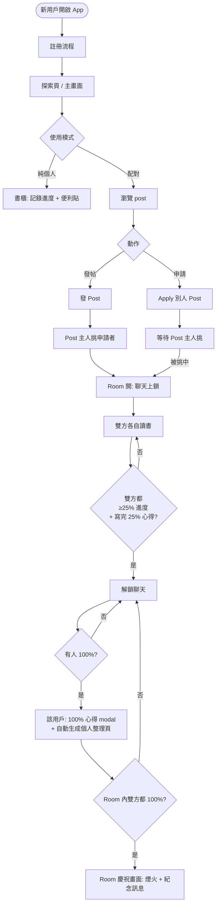
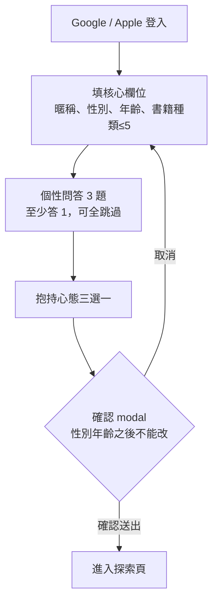
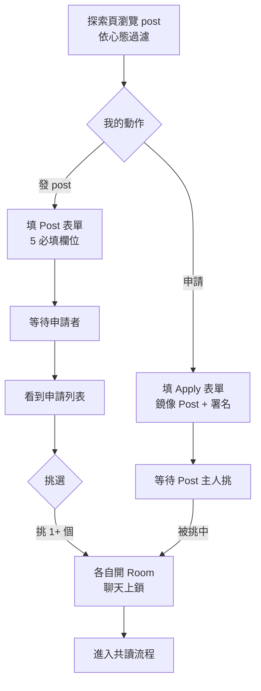
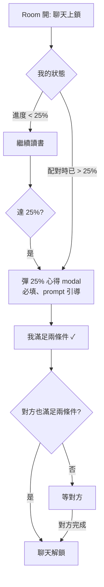
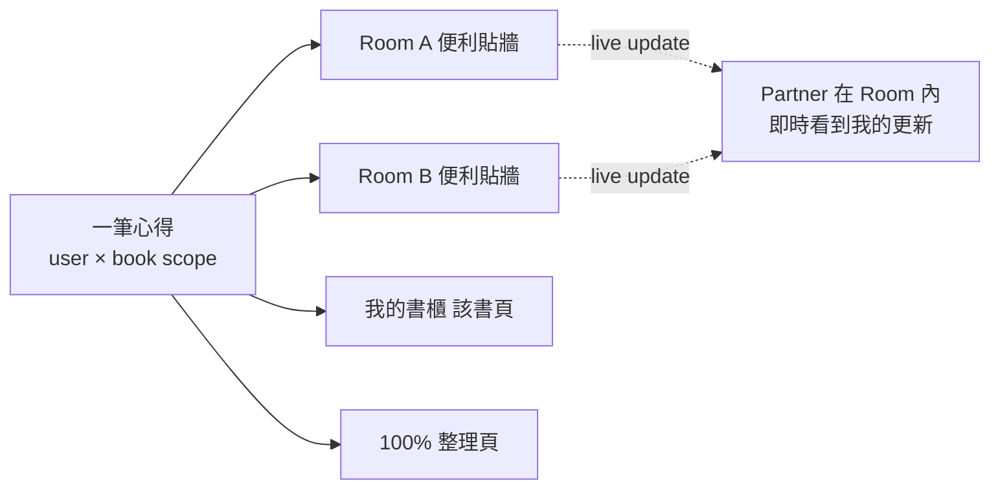

# Folio App 設計文件

## 概覽

Folio 是一款以「共讀關係」為核心的書籍社交 App。
不同於 Goodreads（個人讀書記錄）或一般交友 App（純配對），
Folio 的差異化定位是：**讓書成為兩個人之間的關係媒介**。

### 核心設計原則

1. **進度模型 = User × Book**：一本書一個全局進度，跨所有共讀 room 與書櫃同步
2. **配對 = 手動挑選**：post 主人從申請者中自選，不做演算法
3. **儀式感勝過效率**：聊天有解鎖門檻、雙方達成才慶祝、100% 整理頁可分享
4. **個人模式並存**：書櫃可單獨用、不配對也行；配對是 opt-in

---

## 全域流程圖



---

## 1. 註冊流程

### Step 1.1 — 第三方登入
- Google 登入
- Apple 登入

### Step 1.2 — 基本資料

**核心欄位（必填）：**

| 欄位 | 規則 |
|---|---|
| 暱稱 | 必填 |
| 性別 | 必填 |
| 年齡 | 必填 |
| 喜歡的書籍種類 | 必填、可新增自訂、最多 5 個 |

**個性問答（至少答 1 題、最多 3 題；整組可在註冊時跳過、之後到我的頁面補）：**

1. 哪一本書最能形容你自己，為什麼？（free text）
2. 如果你的人生是一本書，這本書的名字會叫什麼？（free text）
3. 每週花多少時間在看書？（5 區間單選：< 1 / 1–3 / 3–7 / 7–14 / 14+ 小時）

### Step 1.3 — 抱持的心態

三選一：

- **純粹書友**
- **純粹找緣分**
- **不拘**

### Step 1.4 — 確認 modal

> ⚠️「以下資料確定無誤嗎？**性別、年齡** 註冊後將無法直接更改；如需更改需提交審核。」
>
> [取消 → 回上一步] [確認送出]

### 註冊流程圖



---

## 2. 探索頁 / Feed

### 2.1 Feed 過濾矩陣

| 我的心態 \ 對方心態 | 純粹書友 | 純粹找緣分 | 不拘 |
|---|---|---|---|
| **純粹書友** | ✅ 互看 | ❌ 互不可見 | ✅ 互看 |
| **純粹找緣分** | ❌ 互不可見 | ✅ 互看 | ✅ 互看 |
| **不拘** | ✅ 互看 | ✅ 互看 | ✅ 互看 |

→ **純粹書友 ↔ 純粹找緣分** 互不可見；**不拘** 是中介通道

### 2.2 心態 Badge
- 所有 post 與用戶 profile 都顯示作者的心態標籤（純粹書友 / 純粹找緣分 / 不拘）
- 讓瀏覽者一眼知道對方類別、做出自己的選擇

### 2.3 個性問答可見性
- 問答內容顯示在用戶 profile
- 跟隨 feed 過濾矩陣：只有同 pool（含不拘）能看到
- 沒答的題目不顯示

---

## 3. 發 Post / Apply / 配對

### 3.1 Post 欄位（全部必填）

| 欄位 | 說明 |
|---|---|
| 書名 | 想找人共讀的書 |
| 目前進度 | 0–100%。書櫃有此書 → 預設帶入、可調；沒有 → 強制手拉 |
| 為什麼想讀 | free text |
| 期待對方 | 想找怎樣的讀書夥伴，free text |
| 預期週數 | 選項組（節奏匹配信號）|

### 3.2 Apply 表單（鏡像 Post，含文案微調）

| 欄位 | 對應 Post |
|---|---|
| 書名 | 自動帶入 |
| 目前進度 | 同 Post 規則 |
| 為什麼想讀（→ 為什麼想加入這本書的共讀）| 文案微調 |
| 期待對方（→ 我能成為怎樣的讀書夥伴）| 文案微調 |
| 預期週數 | 同 Post |

**署名特性**：申請者寫的句子會自動帶上 post 主人的名字（"@PostOwner..."）；這些句子之後也可被引用到 room 對話中。

### 3.3 配對行為

- Post 主人從申請者列表**手動挑**
- 可挑 1 個或多個 → 每挑一個就開一個 room（多 room 同書 OK）
- 進度欄位**只是顯示**給人類判斷，**不**自動篩選

### 3.4 配對流程圖



---

## 4. 共讀室

### 4.1 Room 狀態
- 配對成立 → room 開、聊天上鎖、UI 顯示進度條 + 解鎖提示
- 房內 sticky 顯示雙方進度 + 心得便利貼牆

### 4.2 聊天解鎖條件（雙方各自滿足才解鎖）

每方需要兩個 ✓：

1. **進度條件**：自己進度 ≥ 25%
2. **心得條件**：自己寫完 25% 心得（必填）

→ 雙方共 4 個 ✓ 全部達成才解鎖聊天

**特殊情境**：
- 配對時你進度已 > 25% → 進度條件 auto 通過、但心得仍需補寫
- 配對時對方進度 0% → 你已 ≥ 25% 但對方還沒 → room 仍上鎖、等對方追上

### 4.3 解鎖流程圖



### 4.4 對話顯示（技術建議）

> 此段為實作建議，非用戶級設計

- **時區**：以用戶當地時區顯示時間
- **日期分隔**：不同日的訊息間插入日期分隔列（"5 月 7 日"）
- **訊息儲存策略**：每則訊息存 UTC timestamp + sender_id + content + room_id；前端按用戶時區顯示
- **訊息分頁**：採游標分頁（cursor pagination）按 timestamp 倒序載入，減少全表掃描成本

---

## 5. 心得系統

### 5.1 三種心得類型

| 類型 | 必填 | 觸發 |
|---|---|---|
| **隨時心得** | 自由 | 用戶於聊天室或書櫃主動寫 |
| **25% 心得** | ✅ 必填 | 達 25% 或配對時已超過；解鎖聊天條件之一 |
| **100% 心得** | 可跳過 | 達 100% modal 跳出 |

### 5.2 Prompt 設計
- 給幾個簡單問題（例：「目前你對這本書的感受？」「印象最深的一段？」「有什麼疑問？」）
- 至少答 1 題即可送出

### 5.3 心得 Scope
- **User × Book**：一筆心得屬於 (user, book)
- 顯示位置：所有共讀此書的 room（partner 即時可見）+ 我的書櫃 + 100% 整理頁
- 寫在聊天室或書櫃 → **同一筆**心得、雙處同步顯示
- UI：全部以**便利貼**形式呈現

### 5.4 心得同步流程圖



---

## 6. 100% 事件（雙重並存）

### 6.1 個人 100% 事件
- 觸發：個人達 100%
- 跳出 100% 心得 modal（可跳過）
- **自動生成「100% 心得整理頁」**：
  - 內容：此書這個用戶的所有便利貼（隨時 + 25% + 100%）
  - 視覺：講究排版、便利貼風格
  - 行為：可分享 IG / Threads / X 等社交媒體（內建分享按鈕、Folio 浮水印）
  - **目的：用戶分享 = 自然行銷管道**

### 6.2 Room 雙方 100% 事件
- 觸發：room 內雙方都達 100%
- Room 內額外觸發**慶祝畫面**：煙火 / 動畫 + 紀念訊息
- 紀念訊息可包含開始日 / 結束日 / 共讀時長等

### 6.3 為何兩事件並存
- **個人整理頁**＝「我跟這本書的故事」（適合 SNS 分享、是個人 artifact）
- **Room 慶祝**＝「我跟這位夥伴一起做到了」（room 內專屬儀式、是關係 artifact）
- 兩者面向不同情感、不衝突也不重複

---

## 7. 我的頁面（Profile）

### 7.1 欄位可改規則

| 欄位 | 規則 |
|---|---|
| 暱稱 | 可改、**30 天冷卻** |
| 性別 | 🔒 鎖死，需提交審核 |
| 年齡 | 🔒 鎖死，需提交審核 |
| 喜歡的書籍種類 | 可改、無冷卻 |
| 個性問答（3 題）| 自由增 / 改 / 清空、無冷卻 |
| 抱持心態 | 可改、**7 天冷卻**（首次更換也算）|

### 7.2 心態變更冷卻 UI
- 點選新心態時跳訊息：「更換後將進入 7 天冷卻期，期間無法再次變更，確定？」
- 冷卻期內按下選項顯示倒數時間

---

## 8. 書櫃

### 8.1 內容
- 用戶的書籍清單（可手動加 / 從共讀導入）
- 每本書顯示：進度（user × book，跨所有 room 同步）、便利貼牆
- 100% 已完成的書，顯示「整理頁」入口

### 8.2 純個人模式
- 書櫃可單獨使用、不必配對
- 純粹當個人讀書記錄器（進度 + 便利貼）
- 配對是 opt-in、可隨時透過探索頁進入

---

## 9. 待決定 / 後續考量（小範圍、非阻擋）

這些不影響主流程上線、可在實作中迭代：

- 100% 整理頁的視覺模板（之後 UX 設計階段定）
- 25% 心得 prompt 的具體題庫（內容團隊撰寫）
- 性別 / 年齡 審核流程（客服 / Admin 後台、規格獨立）
- 書籍資料來源（書名是 free text 還是接 API 如 Google Books / Open Library）
- 多 room 同書的進度更新衝突處理（樂觀更新 vs 全域 lock — 預設樂觀）
- V3+：語言搭子 / 課程夥伴是否獨立 tab（先在以書會友 pool 用書名"日文 N1"等試水）

---

## 10. 資料模型 hint（給實作參考）

```
user
  ├─ id, nickname, gender (locked), age (locked)
  ├─ book_categories[≤5]
  ├─ qa_answers[3 nullable]
  ├─ stance (純粹書友 / 純粹找緣分 / 不拘)
  └─ stance_changed_at (cooldown 計算)

book
  └─ id, title, ...

reading_progress  -- PK: (user_id, book_id), User × Book
  └─ progress (0–100), updated_at

note  -- 便利貼，user × book scope
  ├─ id, user_id, book_id
  ├─ type (free / milestone_25 / milestone_100)
  ├─ content (prompt 答覆)
  └─ created_at

post
  ├─ id, owner_id, book_id
  ├─ progress_at_post, why_read, partner_expectation, expected_weeks
  └─ status (open / closed)

application
  ├─ id, post_id, applicant_id
  ├─ progress_at_apply, why_read, self_offer, expected_weeks
  └─ status (pending / accepted / rejected)

room
  ├─ id, post_id, user_a_id, user_b_id, book_id
  ├─ created_at
  └─ chat_unlocked_at (兩邊條件達成時填)
```

---

## 變更記錄

- 2026-05-07：初版設計、整合所有 TBD 決策
